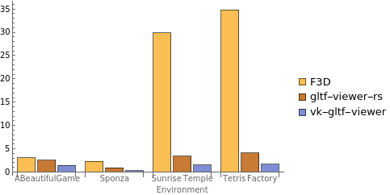

# Performance Comparison

I made a video that compares the loading time and average running FPS of each desktop glTF viewer applications. Click the below image will redirect the page to the YouTube video (due to the GitHub's policy, I cannot directly embed the video into markdown).

## Experiment Methods

The applications used for comparison are:

- [F3D](https://github.com/f3d-app/f3d): Fast and minimalist 3D viewer (upper-left).
- [Vulkan-glTF-PBR](https://github.com/SaschaWillems/Vulkan-glTF-PBR): Physical based rendering with Vulkan using glTF 2.0 models (upper-right).
- [gltf-viewer-rs](https://github.com/adrien-ben/gltf-viewer-rs): glTF 2.0 file viewer written in Rust using Vulkan (lower-left).
- And my application (lower-right).

And it loads the following models sequentially:

- [ABeautifulGame](https://github.com/KhronosGroup/glTF-Sample-Assets/tree/main/Models/ABeautifulGame) from Khronos's Official [glTF-Sample-Assets](https://github.com/KhronosGroup/glTF-Sample-Assets) repository. 30 MB.
- [Sponza](https://github.com/KhronosGroup/glTF-Sample-Assets/tree/main/Models/Sponza) from Khronos's Official [glTF-Sample-Assets](https://github.com/KhronosGroup/glTF-Sample-Assets) repository. 52.7 MB.
- [Sunrise Temple Environment](https://sketchfab.com/3d-models/sunrise-temple-environment-aebbcf55f5e34401bba8220743596060) from Sketchfab. 2.4M triangles, 2.2M vertices, 24 textures, 500 MB.
- [Tetris Factory](https://sketchfab.com/3d-models/tetris-factory-29d3a4bb450844bfa2dcdbcd80092716) from Sketchfab. 503K triangles, 282K vertices, 37 textures, 371 MB.

I tried to make the running configuration as same as possible for fair comparison.

- For F3D, I turned off the ambient occlusion, axis/grid visualization and HDRI ambient lighting. And turned on the antialiasing and HDRI skybox lighting. Since F3D is based on OpenGL, it does not support the Metal FPS HUD, therefore I used the application-provided FPS meter.
- For gltf-viewer-rs, I turned off the SSAO and turned on the HDR tone mapping.
- For Vulkan-glTF-PBR, I don't know why but the swapchain is always presenting the image at fixed 120 FPS (regardless of the rendering time, even it took more than its vsync time!), therefore I slightly modified the FPS print code so that it can measure **the time between each `vkQueuePresentKHR` call**. Since this limit, **even if the real FPS is more than 120 FPS, it is recorded as 120 FPS.**
- For my application, I disabled the mouse picking and outline rendering.
- For Vulkan applications (except for F3D), 
  - I disabled the validation layer for the entire system using Vulkan configurator.
  - I provided the environment variables `MVK_CONFIG_SPECIALIZED_QUEUE_FAMILIES=1` (which enables the dedicated compute and transfer queue family in MoltenVK) and `MVK_CONFIG_USE_METAL_ARGUMENT_BUFFERS=1` (which enables the Metal argument buffers in MoltenVK) for best performance.

## Result

### Loading Time

|           Model            |         F3D         |  Vulkan-glTF-PBR  |  gltf-viewer-rs   | vk-gltf-viewer (baseline) |
|:--------------------------:|:-------------------:|:-----------------:|:-----------------:|:----------------------------:|
|       ABeautifulGame       |  3.05 s (2.06x)  | 2.15 s (1.45x) | 2.58 s (1.74x) |            1.48 s            |
|           Sponza           |  2.3 s (8.21x)   | 1.28 s (4.57x) | 0.9 s (3.21x)  |            0.28 s            |
| Sunrise Temple Environment | 29.87 s (19.78x) | 6.65 s (4.40x) | 3.4 s (2.25x)  |            1.51 s            | 
|       Tetris Factory       | 34.85 s (20.5x)  | 6.08 s (3.57x) | 4.09 s (2.41x) |            1.7 s             |

### Rendering Time

TODO. See the above video for detail.